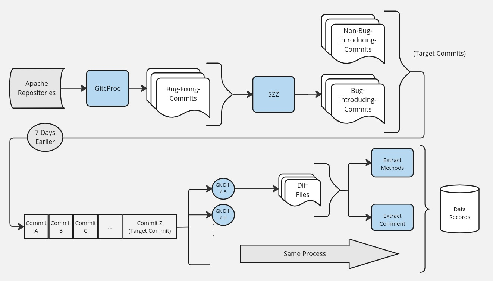

# Code Comment Inconsistency Impact on Bug-Intorducing

This repository is part of our research on the impact of code-comment inconsistency on bug introduction, utilizing large language models such as GPT-3.5.

## RQ1: How does Chat-GPT-3.5 perform in detecting inconsis-tency between code and comments compared to other state-of-the-art deep learning-based models?

Please check the [finetune.py](finetune.py) for the fine-tuning process. The comparison process is done in [gt-concurrent.py](gt-concurrent.py)

## RQ2: Does inconsistency between comments and code impact bug proneness?

## RQ3: How does the impact of outdated comments on bug-proneness change over time?

- To generate records from the identified bug-introducing commits, use the [SZZ-2-CPs](SZZ-2-CPs) directory.

- Then, using the [chat-gpt-api.py](chat-gpt-api.py) file, perform inconsistency detection with the GPT model.

- Use [clean-records.py](clean-records.py) to perform post-processing on the results received from the GPT model.

- Use [compare.py](compare.py) to see the impact analysis in each repo.
